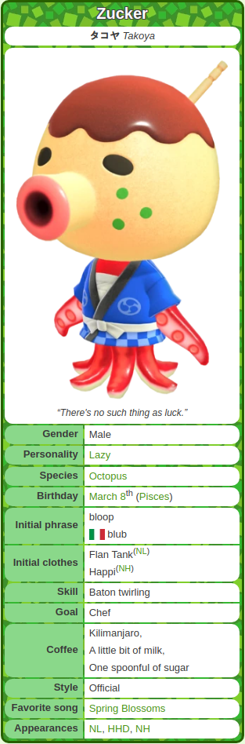

# animal-crossing-wiki-villager-scraper

A web scraper for Animal Crossing: New Horizons villagers, scraping from [animalcrossing.fandom.com](https://animalcrossing.fandom.com).

I wanted data on Animal Crossing: New Horizons villagers, but couldn't find anything available myself, so I made this 
one. It scrapes the [New Horizons](https://animalcrossing.fandom.com/wiki/Villager_list_(New_Horizons)) villager 
page to collect data. This data includes (but is not limited to):
* Name (English *and* Japanese)
* Personality
* Species
* Birthday
* Coffee Preferences
* Appearances

## Requirements

The entire project is built using ``Python 3``, which you can install from [here](https://www.python.org/).

## Usage

To run the scraper and collect the data, clone the project and switch to its directory:

```shell script
git clone https://github.com/bradendubois/animal-crossing-wiki-villager-scraper ac-scraper
cd ac-scraper
```

Then, just run ``main_scraper.py`` with Python:
```shell script
python main_scraper.py
```

### Accessing Data

<div style="display: inline; flex-direction: row;">

<div>

A directory ``villager-data`` is created in the root of the project, which will contain a file ``villager-data.json``, 
holding all the JSON data for the villagers. A subdirectory, ``images``, will be created in ``villager-data``, holding 
an image for each villager.


The JSON data will have a villager's name as a key, and its data will include all attributes available on its 
respective wiki page. For example, [Zucker](https://animalcrossing.fandom.com/wiki/Zucker)'s page, showing the following 
will be formatted as follows:

</div>

<div>



</div>

</div>

```json
"Zucker": {
        "name_en": "Zucker",
        "name_jp": "\u30bf\u30b3\u30e4 Takoya",
        "caption": "\u201cThere's no such thing as luck.\u201d",
        "gender": "Male",
        "personality": "Lazy",
        "species": "Octopus",
        "birthday": [
            "March 8",
            "Pisces"
        ],
        "initial phrase": "bloop",
        "initial clothes": [
            "Flan Tank(NL)",
            "Happi(NH)"
        ],
        "skill": "Baton twirling",
        "goal": "Chef",
        "coffee": [
            "Kilimanjaro",
            "A little bit of milk",
            "One spoonful of sugar"
        ],
        "style": "Official",
        "favorite song": "Spring Blossoms",
        "appearances": [
            "NL",
            "HHD",
            "NH"
        ]
    }
```

**Note**: Villagers will have some properties undefined; for example, not all villagers have a *Skill*, or an *Initial Request*.

## Acknowledgements

* [Fandom](https://animalcrossing.fandom.com), for hosting the Animal Crossing villager data.
* [BeautifulSoup](https://pypi.org/project/beautifulsoup4/), making web scraping easy, since 2004.
